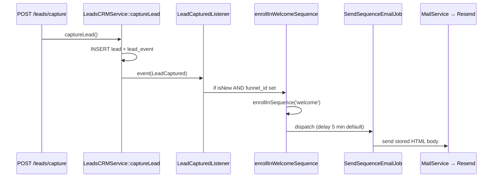

Here is the full welcome-email flow, split into **trigger**, **send**, and **where AI is (and isn't) used**.

## Important distinction

**Sending the welcome email does not call AI.** It reads pre-stored `subject` and `body_content` from `email_sequence_steps` and sends via Resend.

**AI is only used when creating or rewriting a sequence** (agent funnel build, `CREATE_EMAIL_SEQUENCE`, manual AI generation).

---

## 1. How the welcome email is triggered



### Step-by-step

| Step | Method | File |
|------|--------|------|
| 1 | `captureLead()` fires `LeadCaptured` | `LeadsCRMService.php` |
| 2 | `LeadCapturedListener::handle()` | `Listeners/LeadCapturedListener.php` |
| 3 | `enrollInWelcomeSequence($lead, $funnelId)` | `LeadsCRMService.php` |
| 4 | `SequenceEnrollmentService::enrollInSequence(..., 'welcome')` | `SequenceEnrollmentService.php` |
| 5 | `SendSequenceEmailJob::dispatch(...)` | queued on `emails` queue |

The listener only enrolls on **new** leads:

```30:39:c:\Users\abiod\Desktop\WORK\Agentic AI\market-x\app\Listeners\LeadCapturedListener.php
        if ($event->isNew) {
            event(new AgentTriggerReceived(AgentTriggerType::NEW_LEAD, [
                'lead_id' => $lead->id,
                ...
            ]));

            $this->crmService->enrollInWelcomeSequence($lead, $event->funnelId);
        }
```

Enrollment is skipped if there is no `funnel_id`:

```160:164:c:\Users\abiod\Desktop\WORK\Agentic AI\market-x\app\Services\LeadsCRMService.php
    public function enrollInWelcomeSequence(Lead $lead, ?int $funnelId): void
    {
        if (!$funnelId) {
            return;
        }
```

Your Postman `POST /leads/capture` body has no `funnel_id`, and the controller does not pass one — so **welcome email will not fire** on that request.

First email is scheduled here:

```171:183:c:\Users\abiod\Desktop\WORK\Agentic AI\market-x\app\Services\LeadsCRMService.php
        if ($enrolled) {
            ...
                if ($firstStep) {
                    \App\Jobs\SendSequenceEmailJob::dispatch($lead->id, $firstStep->id, $sequence->id)
                        ->delay(now()->addMinutes($firstStep->delay_minutes ?? 5));
                }
```

---

## 2. How the email is actually sent (`SendSequenceEmailJob`)

```77:91:c:\Users\abiod\Desktop\WORK\Agentic AI\market-x\app\Jobs\SendSequenceEmailJob.php
            $bodyContent = $this->personializeBody($step->body_content, $lead);

            $sent = $mailService->send(
                $lead->email,
                $step->subject,
                'emails.dynamic_sequence',
                [
                    'body_content' => $bodyContent,
                    'lead' => $lead,
                    'step_id' => $this->stepId
                ]
            );
```

Personalization is token replacement only (`{first_name}`, `{email}`, etc.) — no AI.

### Resend API payload (actual email send)

```json
POST https://api.resend.com/emails
Authorization: Bearer <RESEND_API_KEY>

{
  "from": "configured@yourdomain.com",
  "to": ["chat-lead@example.com"],
  "subject": "Welcome to My Funnel",
  "html": "<p>Hi there, thank you for joining us!...</p>"
}
```

---

## 3. Where sequence content comes from (no AI on send)

If no welcome sequence exists for the funnel, a **default 5-email sequence** is created with hardcoded HTML:

```230:237:c:\Users\abiod\Desktop\WORK\Agentic AI\market-x\app\Services\SequenceEnrollmentService.php
                $stepDefaults = [
                    [
                        'position' => 0,
                        'subject' => 'Welcome to ' . $funnel->name,
                        'body' => '<p>Hi {first_name}, thank you for joining us! We are excited to have you.</p>',
                        'delay_minutes' => 5
                    ],
```

Email 1 goes out **5 minutes** after enrollment (unless gap/suppression rules delay it).

---

## 4. Where AI **is** used (sequence creation, not send)

There are two AI layers:

### A. Blueprint generation (orchestration planning)

**Class:** `CreateEmailSequenceAction::getBlueprintPrompt()`  
**Called via:** `BaseActionService::callAiForBlueprint()` → `executePrompt()`

Used when the agent **plans** a welcome sequence during funnel build. Prompt includes Mission Brief, timing rules, and asks for JSON like:

```json
{
  "action": "CREATE_EMAIL_SEQUENCE",
  "sequence_config": {
    "name": "...",
    "type": "welcome",
    "trigger_event": "form_submission",
    "total_emails": 3
  },
  "emails": [
    {
      "position": 1,
      "subject": "...",
      "body_html": "<p>...</p>",
      "delay_minutes": 5
    }
  ]
}
```

**AI HTTP payload** (via `UnifiedAiService::executePrompt`):

```json
POST {AI_API_URL}/chat/completions
Authorization: Bearer {AI_API_KEY}

{
  "model": "gpt-4o",
  "messages": [
    {
      "role": "user",
      "content": "# CREATE EMAIL SEQUENCE BLUEPRINT GENERATOR\n\nCreate a detailed blueprint..."
    }
  ],
  "temperature": 1.0
}
```

### B. Sequence content generation (stored in DB)

**Method:** `EmailSequenceService::generateSequenceFromAi()`  
**Called from:** `EmailActionHandler::createSequence()` when `steps` are empty

```182:185:c:\Users\abiod\Desktop\WORK\Agentic AI\market-x\app\Services\EmailSequenceService.php
            $response = $aiService->executeChatCompletion([
                ['role' => 'system', 'content' => $systemPrompt],
                ['role' => 'user', 'content' => "Generate a smart email sequence for trigger: {$params['trigger_event']}"]
            ], 0.7, []);
```

**System prompt** is built in `buildSequencePrompt()` with:
- Mission Brief (`AgentConfig`: business name, product, audience, goal, tone)
- Digital assets (funnels, pages)
- Output schema requiring JSON with `steps[].subject`, `steps[].body_content`, delays

**AI HTTP payload:**

```json
POST {AI_API_URL}/chat/completions

{
  "model": "gpt-4o",
  "messages": [
    {
      "role": "system",
      "content": "# SMART EMAIL SEQUENCE GENERATION (prompt v1.2.0)\n\n## MISSION BRIEF\nBusiness: ...\n..."
    },
    {
      "role": "user",
      "content": "Generate a smart email sequence for trigger: form_submission"
    }
  ],
  "temperature": 0.7
}
```

**Expected AI response** (parsed and saved to DB):

```json
{
  "promptVersion": "1.2.0",
  "name": "Welcome Nurture Series",
  "description": "...",
  "trigger_event": "form_submission",
  "steps": [
    {
      "subject": "Welcome aboard!",
      "body_content": "<p>Hi there...</p>",
      "delay_value": 5,
      "delay_unit": "minutes",
      "delay_reference": "after_opt_in",
      "order_index": 0
    }
  ],
  "rationale": "..."
}
```

That JSON is persisted via `createSequence()` — later sends use those stored steps.

---

## 5. Secondary path: agent `NEW_LEAD` trigger

`LeadCapturedListener` also fires `AgentTriggerReceived(NEW_LEAD)`, which can create an `ENROLL_IN_SEQUENCE` agent task (seeded in `AgentSeeder`).

That path goes through `EmailActionHandler::enrollInSequence()`, which **requires `lead_id` and `sequence_id`** — it does not resolve a welcome sequence by type alone. The direct `enrollInWelcomeSequence()` path is the one that actually works for automatic welcome on capture.

---

## Summary

| Phase | Uses AI? | Key method |
|-------|----------|------------|
| Lead captured | No | `captureLead()` |
| Enroll in welcome | No | `enrollInWelcomeSequence()` |
| Create default sequence | No (hardcoded HTML) | `createDefaultWelcomeSequence()` |
| Create AI sequence | **Yes** | `generateSequenceFromAi()` |
| Send welcome email | No | `SendSequenceEmailJob` → `MailService` → Resend |
| Personalize at send | No (token replace) | `personializeBody()` |

**Gotcha for your tests:** pass `funnel_id` on capture (or ensure the lead has one) or welcome enrollment exits immediately.

Want me to add `funnel_id` to the capture endpoint so your Postman test triggers the full welcome flow?
