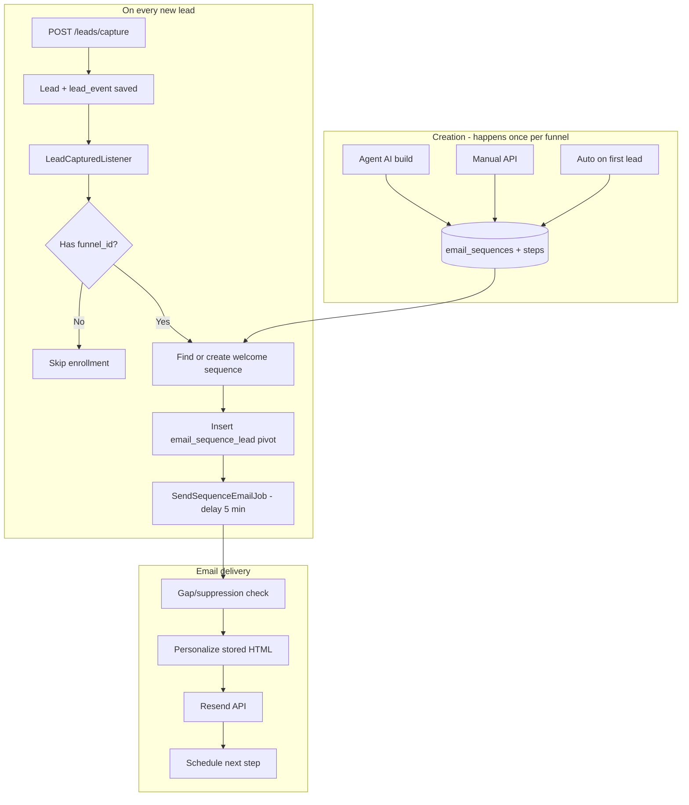

There are **three ways** a welcome sequence gets created, then one path that **uses** it when a lead is captured.

---

## How a welcome sequence is created

### Path A — Auto-created on first enrollment (most common in dev)

**When:** A **new lead** is captured with a `funnel_id`, and no welcome sequence exists for that funnel yet.

**Where:** `SequenceEnrollmentService::createDefaultWelcomeSequence()`

**Trigger chain:**
```
POST /leads/capture (with funnel_id)
  → captureLead()
  → LeadCaptured event (after commit)
  → LeadCapturedListener
  → enrollInWelcomeSequence()
  → enrollInSequence($lead, $funnelId, 'welcome')
  → getOrCreateSequenceForFunnel()  ← no sequence found
  → createDefaultWelcomeSequence()  ← creates it now
```

**What it creates:**
- 1 row in `email_sequences` (`sequence_type = welcome`, `funnel_id` set, `is_active = true`)
- 5 rows in `email_sequence_steps` with hardcoded HTML (no AI)
- Delays: 5 min → 1 day → 2 days → 4 days → 7 days

---

### Path B — Agent creates it with AI (funnel build / orchestration)

**When:**
- User builds a funnel via the agent (“build a lead funnel with welcome sequence”)
- Orchestrator decides: “no email sequence + leads captured” → `CREATE_EMAIL_SEQUENCE`
- Or PURCHASE flow creates upsell (different type)

**Where:**
1. `CreateEmailSequenceAction` — AI **blueprint** (plan: subjects, delays, objectives)
2. `EmailActionHandler::createSequence()` — executes the task
3. `EmailSequenceService::generateSequenceFromAi()` — AI **writes** the actual email HTML/JSON

**Flow:**
```
Agent instruction / user prompt
  → FunnelBuilderOrchestrationService decides CREATE_EMAIL_SEQUENCE
  → CreateEmailSequenceAction.buildBlueprint()  [AI prompt #1]
  → AgentTask created → ProcessAgentTaskJob
  → EmailActionHandler::createSequence()
  → generateSequenceFromAi()  [AI prompt #2 → saves to DB]
```

AI is used **here**, at creation time — not when sending.

---

### Path C — Manual API (dashboard / Postman)

**When:** You explicitly create one.

**Endpoint:** `POST /api/v2/workspaces/{workspace}/email-sequences`

**Where:** `EmailSequenceController::store()` → `EmailSequenceService::createSequence()`

**Note:** The current request validator does **not** include `funnel_id` or `sequence_type`, so manual sequences may not link to a funnel unless you extend the API. Auto-enrollment looks up sequences by **`funnel_id` + `sequence_type = welcome`**.

---

## Full lifecycle (create → enroll → send)



| Step | When | Method |
|------|------|--------|
| 1. Sequence exists | Before or at first capture | Paths A, B, or C above |
| 2. Lead captured | `POST /leads/capture` | `captureLead()` |
| 3. Listener runs | After DB commit | `LeadCapturedListener` |
| 4. Enroll | New lead + `funnel_id` | `enrollInWelcomeSequence()` |
| 5. Email 1 queued | Right after enroll | `SendSequenceEmailJob` (+5 min) |
| 6. Email sent | Job runs | `MailService` → Resend |
| 7. Email 2+ | After each send | Next step scheduled by delay |

---

## Requirements for welcome email to actually fire

Your capture payload needs:

```json
{
  "workspace_id": 1,
  "funnel_id": 1,
  "email": "chat-lead@example.com",
  "name": "Jane Smith",
  "source": "chat_capture"
}
```

Without `funnel_id`, step 4 is skipped entirely (`enrollInWelcomeSequence` returns early).

---

## Quick mental model

| Question | Answer |
|----------|--------|
| **When is the sequence created?** | At funnel build (agent), manually via API, or lazily on first lead with `funnel_id` |
| **When is a lead enrolled?** | On every **new** lead capture (after commit) |
| **When is email 1 sent?** | ~5 minutes after enrollment (first step delay) |
| **When is AI used?** | Only when the **agent creates** the sequence — not on send |

For your Postman tests today, the lazy path (A) is the easiest: capture a lead with `funnel_id: 1` and the system will auto-create the default 5-email welcome sequence on that first capture.
